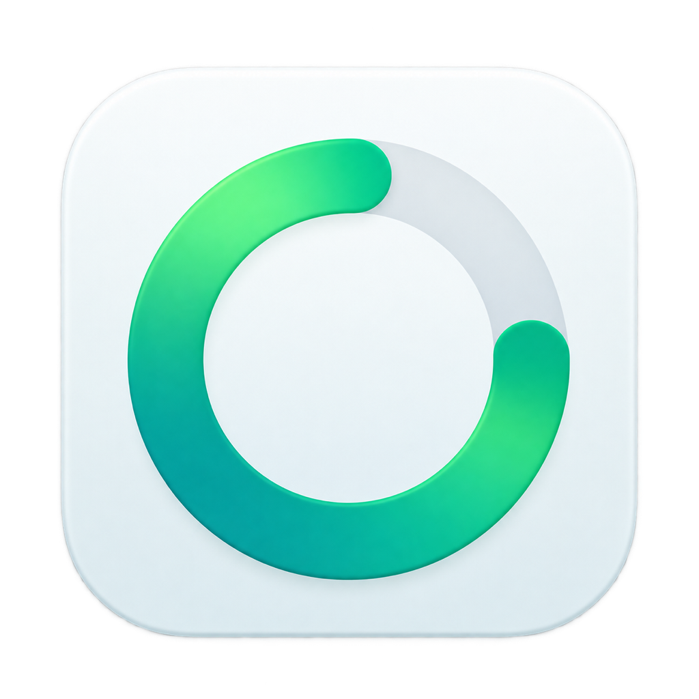

# UsageBar

<p align="center">
  
</p>

<p align="center">
  <a href="https://github.com/queraga/usageBar/releases/latest"></a>
  <a href="https://github.com/queraga/usageBar/actions/workflows/release.yml"></a>
</p>

Your AI usage limits, right in the macOS menu bar.

**Currently supported: OpenAI Work & Codex**

<!-- Add UsageBar screenshot here -->

UsageBar is a lightweight native macOS utility that keeps your remaining 5-hour and weekly usage visible without repeatedly opening another app or settings screen. It reads the limits exposed by the local Codex App Server.

## Features

- 5-hour and weekly usage limits
- Remaining percentage in the menu bar
- Reset times for both limits
- Selectable Week or 5h menu bar metric
- Automatic five-minute refresh and manual refresh
- Native SwiftUI interface
- Launch at login support
- No third-party dependencies

## Installation

1. Download `UsageBar.dmg` from the [latest release](https://github.com/queraga/usageBar/releases/latest).
2. Open `UsageBar.dmg`.
3. Drag UsageBar to Applications.
4. Launch UsageBar.

> The current test build is ad-hoc signed and not notarized. If Gatekeeper blocks the first launch, open **System Settings → Privacy & Security** and choose **Open Anyway** for UsageBar. Do not disable Gatekeeper.

Release binaries are distributed separately and are not stored in the source repository.

## Usage

1. Launch UsageBar and find it in the macOS menu bar.
2. Click the menu bar item to see the 5-hour and weekly limits, including their reset times.
3. Open **Settings** to choose Week or 5h for the menu bar indicator.
4. Choose **Refresh** to update immediately.

The displayed percentages represent remaining capacity. UsageBar also refreshes automatically when it starts and every five minutes afterward.

## Requirements

- macOS 13 or later
- The official ChatGPT desktop app or a compatible Codex installation discoverable by UsageBar
- An authenticated OpenAI or Codex environment
- An account for which the Codex App Server exposes the required limits

Account and plan availability may vary and is still being tested.

## How It Works

```text
UsageBar
  -> local Codex App Server
  -> account/rateLimits/read
  -> OpenAI
```

UsageBar launches the discovered `codex app-server` process and communicates with it over JSON-RPC. Authentication remains managed by the official OpenAI or Codex environment; UsageBar does not need the user's ChatGPT password.

## Privacy

UsageBar itself:

- Does not ask for the user's ChatGPT password
- Does not read browser cookies
- Does not directly read `auth.json`
- Does not directly read Keychain credentials
- Does not store OpenAI access or refresh tokens
- Requests usage information through the local Codex App Server

## Limitations

- UsageBar is available only for macOS.
- It depends on a compatible local Codex App Server.
- Usage availability may vary between accounts and plans.
- It shows the Work/Codex limits returned by `account/rateLimits/read`, not every ChatGPT quota.
- Future App Server versions may change their behavior or protocol.
- The current test build is not notarized.

## Development

1. Clone the repository.
2. Open `UsageBar.xcodeproj` in Xcode.
3. Select the UsageBar scheme and **My Mac**.
4. Build and run.

UsageBar is written in Swift and SwiftUI and targets macOS 13 or later.

Command line equivalents:

```bash
./Tests/run.sh             # provider and store tests
Scripts/build.sh           # release/UsageBar.app
Scripts/make-dmg.sh 0.2.0  # release/UsageBar-0.2.0.dmg
```

Pull requests and pushes to `main` and `develop` run the tests and a Release build on GitHub
Actions. **Actions → CI → Run workflow** builds any branch on demand and attaches the DMG and
zip as downloadable artifacts without publishing anything. Merging to `main` drafts a release
for the version in `MARKETING_VERSION` — see [RELEASING.md](RELEASING.md).

## Architecture

- SwiftUI `MenuBarExtra`
- Foundation `Process` and `Pipe`
- JSON-RPC over standard input and output
- `UsageProvider` abstraction
- Actor-based Codex provider

## License

License information will be added before the public release.
